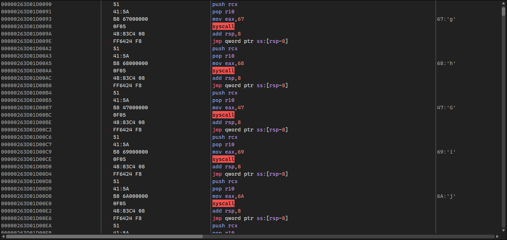

# sec_no_syscalls
## What is this?
This repository provides a clean, lightweight implementation for executing direct syscalls on Windows, bypassing potential hooks in user-mode. The library dynamically extracts syscall numbers from ntdll.dll and generates executable shellcode stubs mapped into executable memory. The syscall stubs are mapped as PAGE_EXECUTE_READ and SEC_NO_CHANGE flags to prevent modification after creation. (Only if you haven't remapped the whole region with the new rights.)

# Usage
## Basic Usage
```cpp
#include "syscall/syscall.hpp"

int main() {
    // Initialize the syscalls
    if (!syscall::initialize()) {
        printf("[*] Failed to initialize syscalls!\n");
        return 1;
    }

    // Use syscalls through the invoke template function
    NTSTATUS status = syscall::invoke<NTSTATUS>(
        "NtAllocateVirtualMemory",
        NtCurrentProcess(),
        &base_address,
        0,
        &region_size,
        MEM_COMMIT | MEM_RESERVE,
        PAGE_READWRITE
    );
    
    // Check syscall numbers if needed
    uint32_t create_file_number = syscall::get_syscall_number("NtCreateFile").value_or(0);
    
    return 0;
}
```

## Helper Functions
You can create your own helper functions to make syscalls even cleaner:
```cpp
NTSTATUS alloc_memory(
    HANDLE process_handle,
    PVOID* base_address,
    SIZE_T region_size,
    ULONG allocation_type,
    ULONG protection
) {
    return syscall::invoke<NTSTATUS>(
        "NtAllocateVirtualMemory",
        process_handle,
        base_address,
        0,
        &region_size,
        allocation_type,
        protection
    );
}

// Usage:
PVOID base_address = nullptr;
SIZE_T region_size = 0x1000;
NTSTATUS status = alloc_memory(
    NtCurrentProcess(),
    &base_address,
    region_size,
    MEM_COMMIT | MEM_RESERVE,
    PAGE_READWRITE
);
```

## How It Works

- Syscall Extraction: The library scans ntdll.dll exports to find syscall functions and their numbers
- Memory map: Creates executable memory regions with proper permissions
- Stub Generation: Generates syscall stubs with the syscall numbers embedded

How syscall stubs look like:
